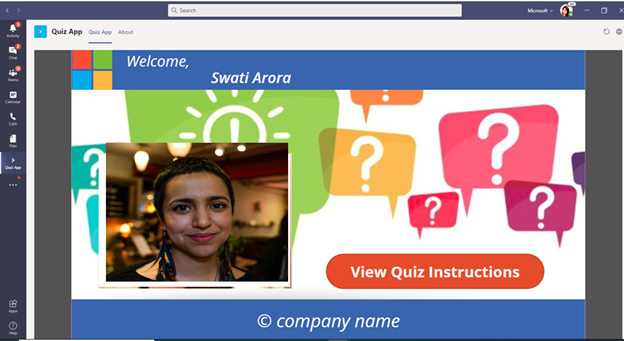
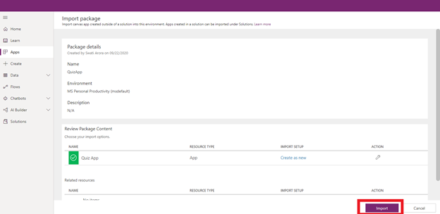
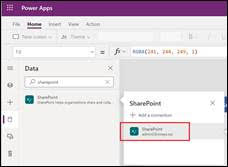
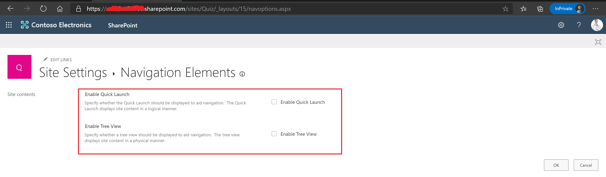

# QuizApp Overview and Deployment Guide

**Quiz App** is a gamification based PowerApp hosted on Microsoft Teams. It is designed to test an end user’s knowledge on Microsoft Teams, thereby facilitating learning and it also helps in providing insights to the organization on areas to drive further awareness. The quiz, pinned on Microsoft Teams, can be easily accessible from any device at any time.

It is a simple and interactive application and can be tailored for any of your internal Learning scenarios as well. The quiz is uniquely designed, in that, it randomly picks 10 questions from a large pool of questions, thereby ensuring that every user gets a unique experience. Questions are given along with four choices, and the user is provided an instant feedback whether he is right / wrong.

## Core Scenario
### Home: 
This is app landing page that is displayed to the users once they login to the Quiz App.

 

### View Instructions: 
On the home page user is asked to view the quiz instructions.

 
 End user can view quiz instructions and then clicking on “Take Quiz” will directly take them to questions screen.

### Take Quiz: 
When end-user clicks on the “Take Quiz” button, he navigates to questions screen. Each question presented on questions screen will be a multiple choice question where user can select the answer by clicking on radio button corresponding to the option. Feedback on correctness of the answer will be displayed on the questions screen to the user once he makes his choice and submits the chosen option.

### End Quiz: 
On submission of the quiz by clicking "Submit Quiz" button, Total Score of the user along with his email and full name will be displayed and same will also be recorded in a share point site.

## Deployment guide
### Prerequisites
To begin, you will need:
* Power Apps Studio
* SharePoint Online
* Office 365 Groups connector
* A copy of QuizApp zip package. Link to [QuizApp package](https://github.com/swatiarora11/QuizApp/blob/master/Deployment/QuizApp.zip)

### Step 1: Create SharePoint Team Site

From Sharepoint Online, create a **Team Site** named as **Quiz**.

 

 

### Step 2: Create SharePoint Lists

#### List1: QuizData (Question Bank for the quiz)
1. We will use an Excel file containing the questions to create this list. For this, download the Excel Template from the repository here - [Sample Quiz Data](https://github.com/swatiarora11/QuizApp/blob/master/Deployment/TeamsQuestionBank.xlsx). 
1. Navigate to the **Documents** document library folder in the Quiz team site and upload this excel document in the same.
 
1. Open **Site Contents** on the **Quiz Team Site** and select **New >> List**.
 
1. Enter the name of the List as **QuizData** and Select **From Excel** to import the list from the Excel file, saved in the **Documents** folder of the **Quiz Team Site**. Hit **Next** to continue.
 
1. You will see a **Loading Tables** message on pressing **Next** and it will thereafter load the table as shown below.
 
1. At this stage, we need to change the List Header fields as follows –
* Set _Option1_ to _Title_
* Set _SNo._ to _Number_
* Set _Question_ to _Multiple lines of text_.
  The columns should appear as shown below. Once you’re done with this, click **Create**.
 
 Once created the **List** should look as shown below -
 
7. Next, we need to rename the column name **Title** to **Option1**. To do this follow the screenshot below –
 
 
 Net Result should look as shown below -
 
8. Select **Option1** column and Drag & Drop the column before **Option2** for better readability of the list.
 
 The list should now look as below –
 

#### List2: UserQuizData

1. Navigate to the **Quiz** SharePoint site via the url - _https://<TenantName>.sharepoint.com/teams/Quiz_ and click on the **New** button to create a new **List**.
 
1. Add list name as **UserQuizData** and click **Create**. Please use this exact name for the list.
1. Add below columns under **UserQuizData** list. Please make sure to follow exact naming convention for the columns as mentioned below. _**Note:** While creating the list, there is no need to add **Title** column, because SharePoint Online will automatically create that column_

Name of Column     	| Type                	| Comment
--------------------| ----------------------| ------------------------------------------------------------
Title				| Single line of text	| Auto generated by SharePoint. We will rename this column to **Email** in next step.
QIndex				| Number				| Serial Number
Question			| Multiple line of text	| Captures the Question attempted by the user.
SubmittedAnswer		| Single Line of text	| Captures the response to the question by the user.
Score				| Number				| Net score based on the answer to the question

4. Rename the **Title** column to **Email**.
 
  Net Result will look as shown below –
 

#### List3: UserQuizSummary

1. Navigate to the **Quiz** SharePoint site via the url - _https://<TenantName>.sharepoint.com/teams/Quiz_ and click on the **New** button to create a new **List**.
 
1. Add list name as **UserQuizSummary** and click **Create**. Please use this exact name for the list.
1. Add below columns under **UserQuizSummary** list. Please make sure to follow exact naming convention for the columns as mentioned below. _**Note:** While creating the list, there is no need to add **Title** column, because SharePoint Online will automatically create that column_

Name of Column     	| Type                	| Comment
--------------------| ----------------------| ------------------------------------------------------------
Title				| Single line of text	| Auto generated by SharePoint. We will rename this column to **Email** in next step.
Name				| Single line of text	| Captures the full name of the user.
Score				| Number 				| Score of the Quiz taken by User
Status				| Yes/No				| Status of Quiz is taken by the user
Time				| Number				| Time captured to attempt the Quiz in seconds

4. Rename the **Title** column to **Email**.
 
  Net Result will look as shown below –
 

#### Step 3: Import Package in Power Apps using zip file
1. Navigate to Power Apps https://make.powerapps.com/
1. Click on Apps in the left side pane and click on **Import canvas app**.
 
1. Import the package zip file.
1. Click on the wrench icon present under **Action** label to change name of the app. Change name of the app to **QuizApp** and click on **Save**.
 
1. Click on **Import** button at bottom.
 
1. You will see a successful messsage after importing the app.

#### Step 4: Edit Data source
1. Click on **Open app** link when zip package is successfully imported. You will be redirected to PowerApps portal.
1. Using left side menu, navigate to **Open > Power Apps > QuizApp** which you have imported.
1. The app will request your permission to use all the listed data connections.
 
1. Go to left menu > click **View** and select **Data sources**.
 **VIMP -** _Delete the 3 existing lists – **QuizData, UserQuizData and UserQuizSummary** as shown below._ These will be reimported in the next step.
 
1. Search and select **SharePoint** site - _https://<TenantName>.sharepoint.com/teams/Quiz_ and click _Connect_
 
1. Enter the SharePoint URL created in above step.
 
1. Select **QuizData, UserQuizData, UserQuizSummary** check boxes and click **Connect**.
 
1. Make the App personal by also adding your Company Name and Logo to the App. Select the Label2_4 in the app and edit the **Text** field as shown –
 
 You may also insert a small image / logo to be placed next to the organization name –
 

#### Step 5: Set Quiz Active Time Duration
1. To set the quiz active time, Navigate to **Welcome Screen** in the **Edit App** page and select **On Visible** Property of the **Welcome Screen** from the top left dropdown.
 
1. Set **QuizStartTime** to date and time when quiz should be live in IST **mm/dd/yyyy hh:mm AM/PM** format.
 
1. Set **QuizEndTime** to date and time when quiz should end in IST **mm/dd/yyyy hh:mm AM/PM** format.
 
1. Now **QuizApp** is ready to be published and shared within your organization.

#### Step 6: Share Power Apps
1. Once the required changes are made in above steps, click on **File >> Save** the app. Thereafter **Publish** the app.
1. Once the app is published, Admin needs to share the app to all individuals who will be using the app. You will get a Share option as soon as you publish the app and if you wish to share the app at this time, **jump to point 6**. Else proceed to **Point 3**.
1. Open https://make.preview.powerapps.com/
1. Go to Apps menu in the left menu bar and you will be able to see the app you have imported.
1. Click on 3 dots (Options) for your app and click on **Share**.
 
1. Enter the **group name** containing the users in the popup and click on **Share**. You can also add additional members if needed. This permission is required to grant access to the **QuizApp**.
 

#### Step 7: Export Teams Package
1. Open https://make.preview.powerapps.com/
1. Go to Apps menu in the left menu bar and you will be able to see the app you have imported.
1. Click on 3 dots (Options) for your app and click on **Add to Teams**.
 
1. Click on **Download App** in the popup to download a zip package.

#### Step 8: Adding App to Teams via Teams Admin Center
1. We will now pin the app to the Teams App for all users. This can be done via the Teams Admin Center.
 
 
 Net result once upload is complete should be – Admin can easily find the **Quiz App** under the **Manage Apps** tab, as shown below
 
 _**NOTE – Ensure that Custom App policy permission has been enabled under Permission Policies.**_
 
1. Next add this App to the **App Setup Policies**, which in turn will make the app visible to all users in the Teams user interface. To add this for all users, select the Global Policy.
 
 
1. Now set the sequence to make the app visible to each user. We recommend to pin the app in the top 5, so that it is easily visible to end users on each client. Hit **Save** to make this change.
 
 That’s it! You will now see the Quiz App pinned on every user’s Teams App experience and you can run the quiz successfully.

## How to Obtain Quiz Results
1. Post the quiz deadline, navigate to the **UserQuizSummary** list created in above steps, in the **Quiz Team Site**.
1. Select **Export to Excel** option. This will download a **query.iqy** file. Open this file and follow the steps to obtain the Excel list with the quiz results.
 
 
 
 **Important Note –**
* The Time field shows the time in **seconds** format.
* The columns which show 36000 secs indicate that a user has closed / refreshed the app, while taking the quiz, hence may be disqualified. Make sure to remove these user entries by Removing Duplicates.
3. **Finding the Winner -**
 One of the approaches to get the winner is by using a **Custom Sort** on the final data (post removing Duplicates).
 
 **Sort condition –**
* Score – Largest to Smallest; and 
* Time – Smallest to Largest

 
 Final Winners - Pick top 3 or 5 winners, as per your choice.

 

## Quiz Data Security 
### Save Quiz List URLs
We are using following sharepoint lists of **Quiz** site for storing QuizApp data:
* QuizData - question bank for the quiz
* UserQuizData - random set of questions presented to each user and their submitted answers
* UserQuizSummary - user wise quiz summary (status, time taken and total score)

By default, sharepoint lists and libraries are visible to all organization users. In case of QuizApp, we would like to hide these lists from all users. 

But before we do that, let us open these three lists one by one from **Site Contents** section of **Quiz Site** and save their URLs to a text file. You can share these saved list URLs with administrators for quiz data management after we hide all the three lists.

### Hide Quiz Lists
Now, for hiding these lists, follow below steps -
1. Go to the **Navigation Elements** section of **Site Settings** and uncheck both **Enable Quick Launch** and **Enable Tree View** checkboxes as shown in the below snapshot.
   
1. Download and install [SharePoint Online Management Shell](https://www.microsoft.com/en-us/download/details.aspx?id=35588).
1. Launch SharePoint Online Management Shell and run `Set-ExecutionPolicy -ExecutionPolicy RemoteSigned -Scope CurrentUser` command to change the execution policy. Refer this [link](https://docs.microsoft.com/en-us/powershell/module/microsoft.powershell.core/about/about_execution_policies?view=powershell-7) for details.
1. A powershell script named [ListVisibility.ps1](https://github.com/swatiarora11/QuizApp/blob/master/Deployment/ListVisibility.ps1) has also been provided in the Deployment folder contained inside QuizApp package downloaded earlier. 
1. Using SharePoint Online Management Shell, navigate to the Deployment folder and run following commands:
`.\ListVisibility.ps1 -admin "<sp_admin_account>" -site "<quiz_site_url>" -list "QuizData" -hidden $true`
`.\ListVisibility.ps1 -admin "<sp_admin_account>" -site "<quiz_site_url>" -list "UserQuizData" -hidden $true`
`.\ListVisibility.ps1 -admin "<sp_admin_account>" -site "<quiz_site_url>" -list "UserQuizSummary" -hidden $true`
6. If above mentioned commands were executed successfully, none of the users will be able to see these lists in **Site Contents** section now. **Please note that quiz administrators can now use list urls provided to them for quiz data management.** 