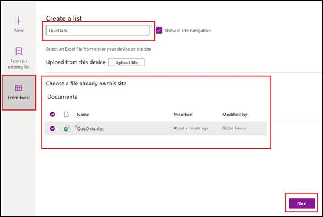
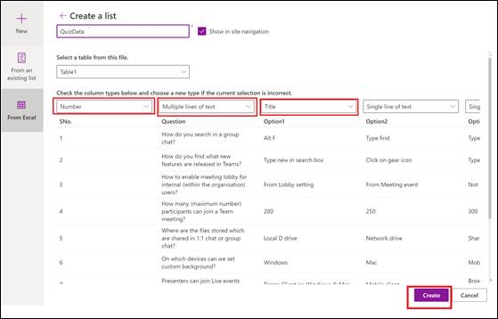

# QuizApp

## Quiz App Overview
Quiz App is a Teams Power Apps designed for end users to facilitate learning, gaining, and improving their knowledge skills. At the meantime, our app provides them fun so that the users can take short quizzes using portable devices such as smart phones and tablets accessing through Teams canvas.

It is also a simple and interactive application and useful for the preparation of any field test. In this app, questions are given along with four choices, and at the end, the correct answer is also displayed. After preparation, one can check their level of know-how on the subject through the quiz. 

## Core Scenario
### Home: 
This is app landing page that is displayed to the users once they login to the Quiz App.

 

### View Instructions: 
By clicking "View Quiz Instructions" on the Home page, user can view quiz instructions.

 

### Take Quiz: 
When end-user clicks on the “Take Quiz” button, he can see questions of the quiz. Every question will be a multiple choice question where user can select the answer by clicking on radio button corresponding to the option. Feedback on correctness of the answer will be displayed on the questions screen to the user once he makes his choice and submits the selected option.

### End Quiz: 
On submission of the quiz by clicking "Submit Quiz" button, Total Score of the user along with his email and full name will be displayed and same will also be recorded in a share point site.

## Deployment guide
### Prerequisites
To begin, you will need:
* Power Apps Studio
* SharePoint
* Office 365 Groups connector
* A copy of the Quiz app zip package

### Step 1: Create SharePoint Lists
#### List1: Quiz Data
This list contains the question bank that we will import from an Excel template (available in the Deployment folder of this repository). *Please ensure to save this Excel file in a folder in your OneDrive for Business.*
Follow the below steps to create this list from the Excel file -
1. Open *Lists* from the Office 365 Portal as shown below.
 
1. Select *New List*.
 
1. Select *From Excel* to import the list from the Excel file.
 
1. Select the file from the OneDrive for Business folder path and select *Next*.
 
1. You will see a *Loading Tables* message on pressing *Next* and it will thereafter load the table as shown below.
 
1. In above, we need to change the *Header field* for *Option 1* to *Title*. Note the change in below screenshot.
 
The list should now look as shown below – Select *Next* once this is done.
 
1. Set a *Name and Description* for the quiz. You may also set a color and icon (Optional)
 
1. In the *Save To* option, we now need to point to the *Quiz” Site* (which was created in *Step 1*) where this list must be deployed. Select this and click *Create* to initiate the creation of the list in the *Quiz Site*.
 
Net outcome should be the list created as shown below –
 
1. Next, we need to again rename the Display Name for the column name *Title* to *Option 1*. To do this follow the screenshot below –
 
 
Net Result should look as shown below -
 

Create the Sharepont site named as “Quiz”. Please follow below steps only if you are creating SharePoint list manually.
1. Click on the new option on the left side of page and select List.
1. Add list name as UserQuizData (make sure to follow the names of list and columns as provided)
and click on create.
1. Add below columns under Incentives list:

_**Note:** While creating each list, no need to add "Title" column, because SharePoint will automatically create that column_

Name of Column     | Type                | Comment
------------------ | --------------------| --------------------------------------
Title              | Single line of text | Auto generated unique id by SharePoint
Name	| Single line of text	| Incentive name (upto 30 characters)
Points	| Number	Incentive points (upto 4 characters)
IncentiveCode	Single line of text	Alpha numeric value provided by admin. For e.g. INC1231(upto 10 characters)
CreatedBy	Single line of text	User object identifier GUID provided by Office 365 connector
CreatedOn	Date	Incentive created date time stamp
DueDate	Date	Incentive expiration date time stamp provided by admin
IsIncentiveLive	Boolean	Flag to check if incentive is available
UpdatedBy	Single line of text	User object identifier GUID provided by Office 365 connector
UpdatedOn	Date	Last updated date time stamp

Content in the first column | Content in the second column
Content from cell 1 | Content from cell 2
Content in the first column | Content in the second column

1. Repeat the steps to create a new list with name UserQuizSummary
1. Add below columns under UserQuizSummary list:
1. Repeat the steps to create a new list with name UserQuizData
1. Add below columns under UserQuizData list:

#### Step 3: Create Incentive admins group
Please ignore steps #1-#7 if you already have a team of admins(who have privilege to manage and share incentive & rewards) and continue with step# 8.
1. Open Teams desktop app or open https://teams.microsoft.com/go#
1. Click on the Teams tab in the left menu bar
1. Click on Join or create team > click Create team button
1. Select Build your team from scratch > Select Private
1. Provide Team name and description > Click Next
1. After that a popup will open where you need to add members in your created team. Add all the
members and then close the popup.
1. Confirm if new team is created successfully.
1. Next to team name, click on the "..." and select "Get link to team".
1. Click on "Copy" to copy the link to clipboard and get the groupId query string value as shown
below:
1.Copy the groupId as it will be used in further steps (Step 4 > #8)

#### Step 3: Import Package in Power Apps using zip file
1. Navigate to Power Apps https://make.powerapps.com/
1. Click on Apps in the left side pane and click on Import canvas app.
1. Import the package zip file.
1. Click on the wrench icon present under ‘Action’ label to changes the name of the app. Change the
name of the app and click on save.
1. Click on import button at bottom.
1. You will see a successful image as below:

#### Step 4: Edit Data source
1. Click on Open app link when zip package is successfully imported. You will be redirected to Power
Apps portal.
1. Click on Open menu at the left side > Power Apps > QuizApp which you have imported.
1. The app will request your permission to use all the listed data connections.
1. Go to left menu > click View and select Data sources.
1. Search and select SharePoint
1. Enter the created SharePoint URL created in Step 1 in pop-up window.
1. Select QuizData, UserQuizData, UserQuizSummary check boxes and click connect.

#### Step 5: Share Power Apps
1. Admin needs to share the app to all individuals who will be using the app.
1. Open https://make.preview.powerapps.com/
1. Go to Apps menu in the left menu bar and you will be able to see the app you have imported.
1. Click on 3 dots (Options) for your app and click on Share.
1. Enter the group name meant for users in the popup and click on Share. You can also add additional
members if needed. This is required to allow members to access Quizapp.

#### Step 6: Export Teams Package
1. Open https://make.preview.powerapps.com/
1. Go to Apps menu in the left menu bar and you will be able to see the app you have imported.
1. Click on 3 dots (Options) for your app and click on Add to Teams.
1. Click on Download App in the popup to download a zip package.

#### Step 7: Adding app to Teams
1. Go to Teams > Apps (in the left menu) > Upload a Custom App.
1. Select the downloaded zip package from the previous step.
1. Click on Add > Add to a team in the popup.
1. Select the team created in Step 1.
1. Click on Setup a tab.
1. The description for the app will be shown in the popup, click on Save.
1. You will be able to see the app in the tab.