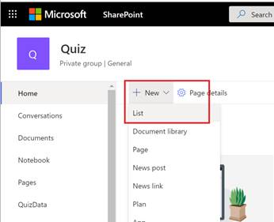
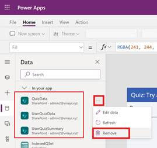
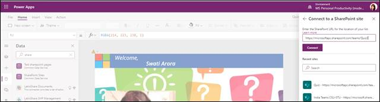

# QuizApp Overview and Deployment Guide

**Quiz App** is a gamification based PowerApp hosted on Microsoft Teams. It is designed to test an end user’s knowledge on Microsoft Teams, thereby facilitating learning and it also helps in providing insights to the organization on areas to drive further awareness. The quiz, pinned on Microsoft Teams, can be easily accessible from any device at any time.

## Core Scenario
### Home: 
This is app landing page that is displayed to the users once they login to the Quiz App.

 

### View Instructions: 
On the home page user is asked to view the quiz instructions.

 
 End user can view quiz instructions and then clicking on “Take Quiz” will directly take them to questions screen.

### Take Quiz: 
When end-user clicks on the “Take Quiz” button, he navigates to questions screen. Each question presented on questions screen will be a multiple choice question where user can select the answer by clicking on radio button corresponding to the option. Feedback on correctness of the answer will be displayed on the questions screen to the user once he makes his choice and submits the chosen option.

### End Quiz: 
On submission of the quiz by clicking "Submit Quiz" button, Total Score of the user along with his email and full name will be displayed and same will also be recorded in a share point site.

## Deployment guide
### Prerequisites
To begin, you will need:
* Power Apps Studio
* SharePoint
* Office 365 Groups connector
* A copy of the Quiz app zip package (download here)

### Step 1: Create SharePoint Team Site

From Sharepoint Online, create a **Team Site** named as **Quiz**.

 

 

### Step 2: Create SharePoint Lists

#### List1: Quiz Data
This list contains the question bank that we will import from an Excel template. Get [Sample Quiz Data](https://github.com/swatiarora11/QuizApp/blob/master/Deployment/TeamsQuestionBank.xlsx). 

Note - *Please ensure to save this Excel file in a folder in your OneDrive for Business.*

Follow the below steps to create this list from the Excel file -
1. Open **Lists** from the Office 365 Portal as shown below.
 
1. Select **New List**.
 
1. Select **From Excel** to import the list from the Excel file.
 
1. Select the file from the OneDrive for Business folder path and select **Next**.
 
1. You will see a **Loading Tables** message on pressing **Next** and it will thereafter load the table as shown below.
 
1. In above, we need to change the **Header field** for **Option 1** to **Title**. Note the change in below screenshot.
 
The list should now look as shown below – Select **Next** once this is done.
 
1. Set a **Name and Description** for the quiz. You may also set a color and icon (Optional)
 
1. In the **Save To** option, we now need to point to the **Quiz” Site** (which was created in **Step 1**) where this list must be deployed. Select this and click **Create** to initiate the creation of the list in the **Quiz Site**.
 
 Net outcome should be the list created as shown below –
 
1. Next, we need to again rename the Display Name for the column name **Title** to **Option 1**. To do this follow the screenshot below –
 
 
 Net Result should look as shown below -
 

#### List2: User Quiz Data

1. Navigate to the **Quiz** SharePoint site via the url - _https://<TenantName>.sharepoint.com/teams/Quiz_ and click on the **New** button to create a new **List**.
 
1. Add list name as **UserQuizData** and click **Create**. Please use this exact name for the list.
1. Add below columns under **UserQuizData** list. Please make sure to follow exact naming convention for the columns as mentioned below.
_**Note:** While creating the list, there is no need to add "Title" column, because SharePoint will automatically create that column_

Name of Column     	| Type                	| Comment
--------------------| ----------------------| ------------------------------------------------------------
Title				| Single line of text	| Auto generated by SharePoint. We will rename this column to **Email** in next step.
QIndex				| Number				| Serial Number
Question			| Multiple line of text	| Captures the Question attempted by the user.
SubmittedAnswer		| Single Line of text	| Captures the response to the question by the user.
Score				| Number				| Net score based on the answer to the question

1. Rename the **Title** column to **Email**.
 
 

#### List3: User Quiz Summary

1. Navigate to the **Quiz** SharePoint site via the url - _https://<TenantName>.sharepoint.com/teams/Quiz_ and click on the **New** button to create a new **List**.
 
1. Add list name as **UserQuizSummary** and click **Create**. Please use this exact name for the list.
1. Add below columns under **UserQuizSummary** list. Please make sure to follow exact naming convention for the columns as mentioned below.
_**Note:** While creating the list, there is no need to add "Title" column, because SharePoint will automatically create that column_

Name of Column     	| Type                	| Comment
--------------------| ----------------------| ------------------------------------------------------------
Title				| Single line of text	| Auto generated by SharePoint. We will rename this column to **Email** in next step.
Name				| Single line of text	| Captures the Display name of the user.
Score				| Number 				| Score of the Quiz taken by User
Status				| Yes/No				| Status of Quiz is taken by the user
Time				| Number				| Time captured to attempt the Quiz in seconds

1. Rename the **Title** column to **Email**.
 
 

#### Step 3: Import Package in Power Apps using zip file
1. Navigate to Power Apps https://make.powerapps.com/
1. Click on Apps in the left side pane and click on **Import canvas app**.
 
1. Import the package zip file.
1. Click on the wrench icon present under **Action** label to change name of the app. Change name of the app to **QuizApp** and click on **Save**.
 
1. Click on **Import** button at bottom.
1. You will see a successful messsage after importing the app.

#### Step 4: Edit Data source
1. Click on **Open app** link when zip package is successfully imported. You will be redirected to PowerApps portal.
1. Click on **Open** menu at the left side > Power Apps > QuizApp which you have imported.
1. The app will request your permission to use all the listed data connections.
1. Go to left menu > click **View** and select **Data sources**.
1. Search and select **SharePoint** site - _https://<TenantName>.sharepoint.com/teams/Quiz_
1. Enter the SharePoint URL created in above step.
 
1. Select **QuizData, UserQuizData, UserQuizSummary** check boxes and click **Connect**.
 

#### Step 5: Share Power Apps
1. Admin needs to share the app to all individuals who will be using the app.
1. Open https://make.preview.powerapps.com/
1. Go to Apps menu in the left menu bar and you will be able to see the app you have imported.
 
1. Click on 3 dots (Options) for your app and click on **Share**.
1. Enter the **group name** containing the users in the popup and click on **Share**. You can also add additional members if needed. This permission is required to grant access to the **QuizApp**.

#### Step 6: Export Teams Package
1. Open https://make.preview.powerapps.com/
1. Go to Apps menu in the left menu bar and you will be able to see the app you have imported.
1. Click on 3 dots (Options) for your app and click on **Add to Teams**.
 
1. Click on **Download App** in the popup to download a zip package.

#### Step 7: Adding App to Teams via Teams Admin Center
1. We will now pin the app to the Teams App for all users. This can be done via the Teams Admin Center.
 
 
 Net result once upload is complete should be – Admin can easily find the **Quiz App** under the **Manage Apps** tab, as shown below
 
 _**NOTE – Ensure that Custom App policy permission has been enabled under Permission Policies.**_
 
1. Next add this App to the **App Setup Policies**, which in turn will make the app visible to all users in the Teams user interface. To add this for all users, select the Global Policy.
 
 
1. Now set the sequence to make the app visible to each user. We recommend to pin the app in the top 5, so that it is easily visible to end users on each client. Hit **Save** to make this change.
 
 That’s it! You will now see the Quiz App pinned on every user’s Teams App experience and you can run the quiz successfully.
 